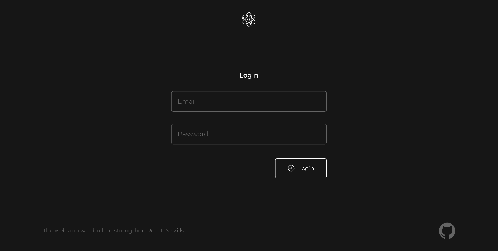
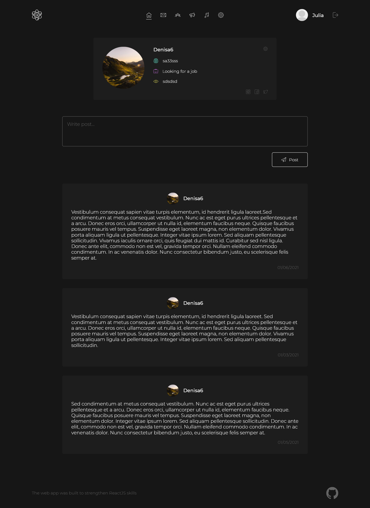
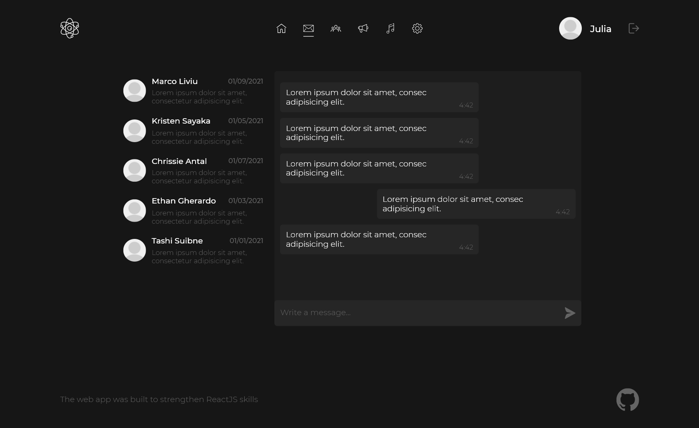
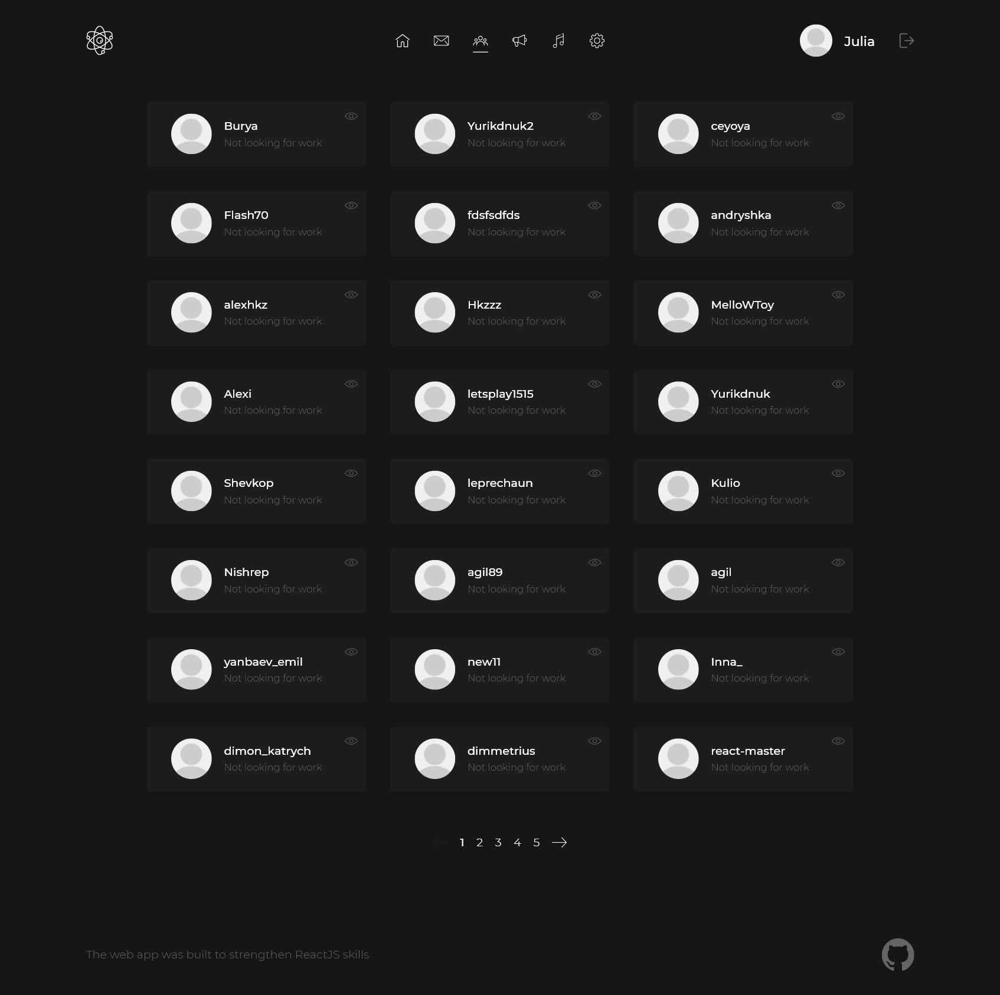
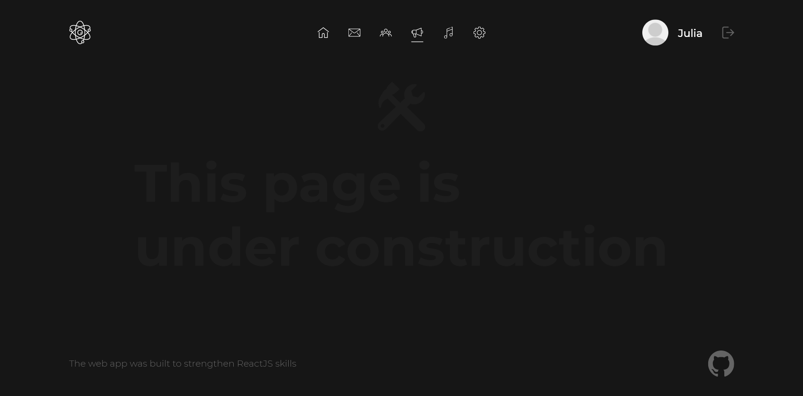

# This my first react-app | version: 1.0.0

This work was done thanks to the YouTube channel:
[IT-KAMASUTRA](https://www.youtube.com/channel/UCTW0FUhT0m-Bqg2trTbSs0g)

Below are screenshots of several pages at the moment.

### 
Login

### 
Profile

### 
Messenger

### 
Users

### 
Construction

